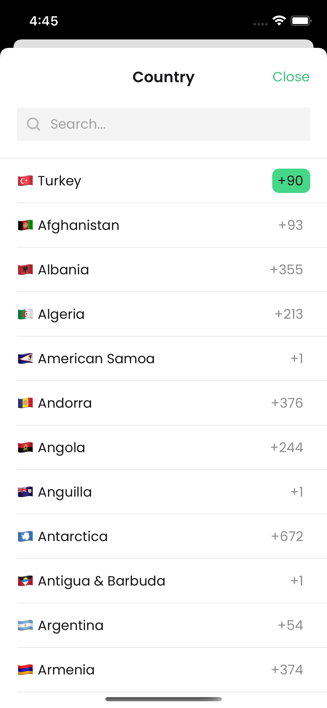
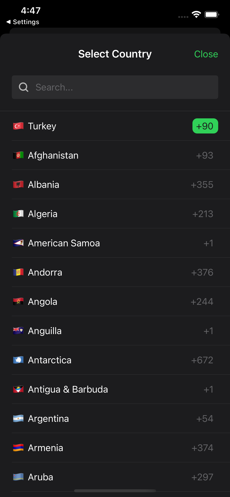
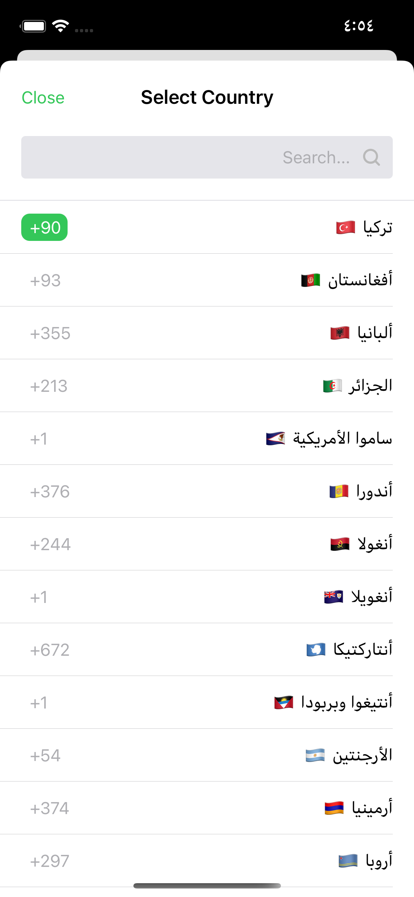

# CountryPicker

Very simple country picker for iOS with elegant design. It uses unicode for country flags.

## Screenshots
|| 

## Requirements
* iOS 12+
* Xcode 12+
* Swift 5.3+

## Installation

Currently CountryPicker is only avaliable via SPM. You can also add manually to your project.

### SPM
If you have already Swift package set up, add CountryPicker as a dependency to your dependencies in your `Package.swift` file.
```swift
dependencies: [
    .package(url: "https://github.com/mobven/CountryPicker.git")
]
```

## Usage

### UIKit
Simply, you present `CountryPickerViewController`. You can set default country for the picker with `selectedCountry` variable (Default value is "TR"). To get informed about country selection, you should conform to `CountryPickerDelegate` in your `UIViewController`.

```swift
let countryPicker = CountryPickerViewController()
countryPicker.selectedCountry = "TR"
countryPicker.delegate = self
self.present(countryPicker, animated: true)
```

### SwiftUI
To present `CountryPickerViewController` on SwiftUI, you need to create a `CountryPicker` representable. Check [docs/SwiftUI](docs/SwiftUI.md) out for details.


#### CountryPickerDelegate

Delegate method will be called with country selection, you can update your outlets with new selected country model.

```swift
extension ViewController: CountryPickerDelegate {
    func countryPicker(didSelect country: Country) {
        countryTextField.text = country.isoCode.getFlag() + " " + country.localizedName
    }
}
```

#### Customization

Default picker theme is supporting Dark Mode for iO13+ devices. You can easly customize the picker with editing `Configuration` properties. If you are adding custom colors, you should add dark appearance color for dark mode support.

```swift
public protocol Configuration {
    var countryNameTextColor: UIColor { get set }
    var countryNameTextFont: UIFont { get set }
    var selectedCountryCodeBackgroundColor: UIColor { get set }
    var selectedCountryCodeTextColor: UIColor { get set }
    var selectedCountryCodeCornerRadius: CGFloat { get set }
    var countryCodeFont: UIFont { get set }
    var countryCodeTextColor: UIColor { get set }
    var closeButtonTextColor: UIColor { get set }
    var closeButtonFont: UIFont { get set }
    var closeButtonText: String { get set }
    var titleTextColor: UIColor { get set }
    var titleFont: UIFont { get set }
    var titleText: String { get set }
    var searchBarPlaceholder: String { get set }
    var searchBarBackgroundColor: UIColor { get set }
    var searchBarPlaceholderColor: UIColor { get set }
    var searchBarFont: UIFont { get set }
    var searchBarLeftImage: UIImage? { get set }
    var searchBarClearImage: UIImage? { get set }
    var searchBarCornerRadius: CGFloat { get set }
    var separatorColor: UIColor { get set }
}
```
##### Example 
You can customize properties like this,
```swift
  CountryManager.shared.config.countryNameTextColor = .black
  CountryManager.shared.config.countryNameTextFont = UIFont.systemFont(ofSize: 16)
```
or you can create your own `Config`

```swift
  let configMaker = Config(
      countryNameTextColor: .black,
      countryNameTextFont: UIFont.systemFont(ofSize: 16),
      selectedCountryCodeBackgroundColor: .green
  )

  CountryManager.shared.config = configMaker()
```

#### Custom UI 

`getCountries()` method in `CountryManager` will return a `Country` array for you, so you can create your own custom UI implementations with this array. 

```swift
  let countries = CountryManager.shared.getCountries()
```
#### Flags

`CountryPicker` uses unicode for country flags. You can use with iso codes like the example below.
```swift
  label.text = "US".getFlag()
```

### Localization

`CountryPicker` is use current `NSLocale` for localization of country name, you can set custom locale before presenting picker.
```swift
  CountryManager.shared.localeIdentifier = "en_US"
  let countryPicker = CountryPickerViewController()
  self.present(countryPicker, animated: true)
```
For page title and close button text you can set localized text with `Configration` properties
```swift
  CountryManager.shared.config.titleText = "Country Picker"
  CountryManager.shared.config.closeButtonText = "Close"
```
`CountryPicker` v1.0.0 is support RTL except displaying localized phone codes.

## What's next
- [x] Sample Project.
- [x] SwiftUI representable code example. 
- [x] Support below iOS 13.
  
---
Developed with 🖤 at [Mobven](https://mobven.com/)
